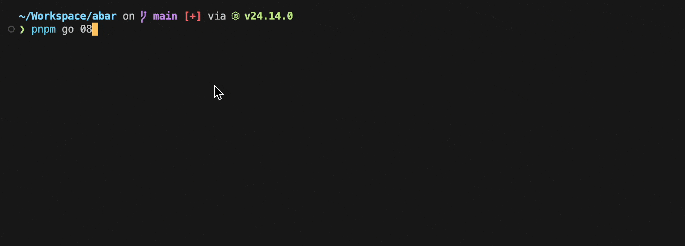

# abar

Active bars for your terminal. Manage live output lines with handles — update, finish, or let them disappear. Normal `console.*` writes coexist cleanly with the bar area.



## Installation

```sh
npm install @abar/abar
# or
pnpm add @abar/abar
# or
yarn add @abar/abar
```

## Examples

See [`examples/`](./examples) for runnable demos.

## Quick Start

```ts
import abar from '@abar/abar'

abar.start()

const bar = abar.add({ text: 'loading...' })

setTimeout(() => {
  bar.update('still loading...')
}, 500)

setTimeout(() => {
  bar.finish('done!')  // prints "done!" permanently and removes the bar
  abar.stop()
}, 1000)
```

Multiple bars:

```ts
import abar from '@abar/abar'

abar.start()

const tasks = ['fetch', 'build', 'deploy'].map(name =>
  abar.add({ text: `[pending] ${name}` })
)

for (const [i, task] of tasks.entries()) {
  await doWork(i)
  task.finish(`[done] ${tasks[i].text?.split(' ')[1]}`)
}

abar.stop()
```

## Core Concepts

### Bar and handle

A bar is a live line of text pinned to the bottom of your terminal. abar owns the rendering — it clears and redraws the bar area around normal log output so the two never collide.

Each bar is created with `abar.add()`, which returns a **handle**. The handle is your control point: you push new text to it, and when the work is done you call `finish()` to either print a final line permanently or silently remove the bar.

A handle moves through three states:

- **init** — created with no `text`, hidden until the first `update(text)` call.
- **active** — has text, included in every render frame.
- **finished** — after `finish()`. Permanently removed; all methods become no-ops. If `finish(text)` is called with a string, that text is written to the stream as a normal log line. Pass `null` to remove silently.

`abar.stop()` clears the bar area but does **not** finish handles — active handles re-appear on the next `abar.start()`.

### Transformer pipeline

Before each frame, abar collects all active bars as `BarEntry[]` and runs them through `config.transformers` in order. Each transformer receives the current entries and returns the list to actually render — you can filter bars, reorder them, rewrite their text, or inject `SyntheticBarEntry` rows (separators, headers, summaries) that aren't backed by a real handle.

```ts
import abar from '@abar/abar'

abar.configure({
  transformers: [
    entries => entries.map(e => ({
      ...e,
      text: `[${new Date().toISOString()}] ${e.text}`,
    })),
  ],
})
```

## Reference

### `abar.configure(options)`

Must be called before `start()` and while no handles are active.

| Option | Type | Default | Description |
|---|---|---|---|
| `stream` | `NodeJS.WriteStream` | `process.stderr` | Stream to render bars into |
| `renderThrottle` | `number` | `16` | Trailing-edge debounce window in ms; rapid updates are collapsed into one render |
| `enabled` | `boolean` | `isInteractive(stream)` | When `false`, all bar operations are no-ops and writes pass through unmodified |
| `discardStdin` | `boolean` | `true` | Put stdin into raw mode while active to prevent input corrupting the bar area |
| `transformers` | `Transformer[]` | `[]` | Ordered pipeline applied to render entries before each frame |

### `abar.add(options)` → `BarHandle`

| Option | Type | Default | Description |
|---|---|---|---|
| `id` | `string` | `crypto.randomUUID()` | Unique identifier |
| `text` | `string` | `undefined` | Initial text; omit to start in `init` state |

### `BarHandle`

| Member | Description |
|---|---|
| `.id` | The id assigned at `add()` |
| `.createdAt` | Timestamp at creation |
| `.updatedAt` | Timestamp at last `update()` |
| `.update(text)` | Set new text and schedule a re-render |
| `.finish(text?)` | Remove from bar area; writes `text` to the stream permanently if given, writes current text if omitted, or removes silently if `null` |

## License

MIT License